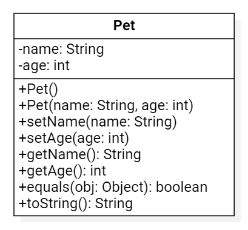

# Midterm Exam

You will have 24 hours to complete this exam. You are not allowed to use any outside notes or resource; all work must be your own. Any code found not to be your own will not be graded. Make sure to read _all_ the instructions for each question carefully and answer each question completely. Once you have finished, please commit and push your work to your repository. Please also confirm that the code is in your remote repository, i.e. that it is on bitbucket.org.

## Question One: Data Types

Write a program that prompts the user for an integer, add 65 to it, convert the result to a character and print that character to the console.

## Question Two: Selection

Write a program that prompts the user for an integer. If the integer is divisible by 2 print out "foo", and if the integer is divisible by 3 print out "bar". If the integer is divisible by both, your program should print out "foobar" and if the integer is not divisible by either, then your program should not print out anything.

## Question Three: Repetition

Write a program that prompts the user for an integer and then prints out a Triangle of that height and width. For example, if the user enters 3, then your program should print the following:

```java
* * *
  * *
    *
```

## Question Four: Arrays

Write a program that prompts the user for 5 words and prints out any word that appears more than once. 

**NOTE:** 

- The words should be an exact match, i.e. it should be case sensitive.
- Your program _must_ use an array.
- Do not sort the data or use an ArrayLists.

## Question Five: Objects

Write a Java class based on the following UML diagram. Include all standard methods, such as constructors, mutators, accessors, toString, and equals. Additionally, implement any other methods shown in the diagram.



**NOTES:**

- `age` needs to be positive.
- You do _not_ need to write an application class.
