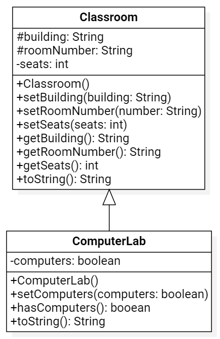
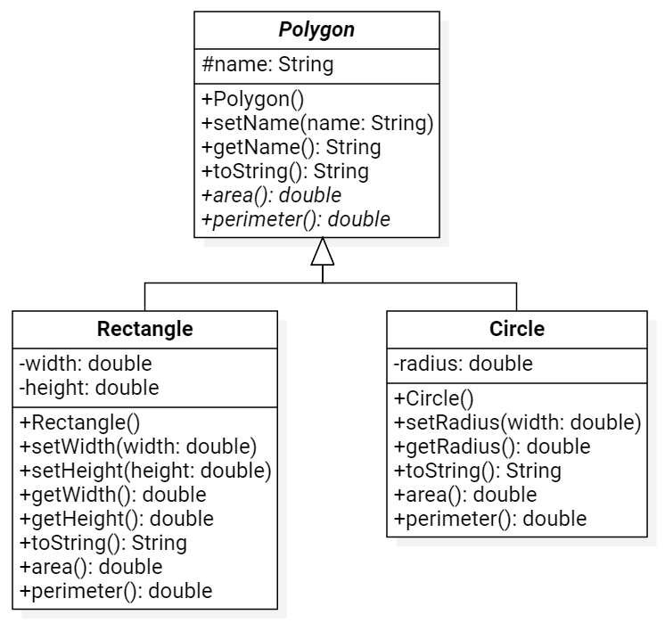

# Final Exam

You will have 24 hours to complete this exam. It is opened notes and opened book, but all code must be your own (no answers found online will be accepted). Make sure to read all the instructions for each question carefully and answer each question completely. Once you have finished, please commit and push you work to your repository. Please also confirm that your code is in your remote repository, i.e. that it is on bitbucket.org.

## Question One: Inheritance/Polymorphism

Write the Java classes based on the following UML diagram. Include all methods shown (you do not need to include any additional ones).

**Notes:**
- `seats` must be positive



## Question Two: Abstract Classes

Write the Java classes based on the following UML diagram. Include all methods shown (you do not need to include any additional ones).

**Notes:**
- The `radius`, `height`, and `width` should always be positive and can default to `1`.
- The `area` of a circle is `Math.PI * radius * radius` and the `perimeter` is `2.0 * Math.PI * radius`.
- The `area` of a rectangle is `height * width` and the `perimeter` is `2.0 * (height + width)`.




## Question Three: ArrayLists

Write a Java program that prompts the user to enter a sequence of numbers, storing them in an ArrayList, and continues prompting the user for numbers until they enter "Done". When they have finished entering numbers, your program should return the minimum and maximum values entered.

## Question Four: Sorting

Write a Java program that implements the Selection Sort Algorithm for an Array (or ArrayList) of Strings and prints the sorted results.

```java
{"speaker", "poem", "passenger", "tale", "reflection", "leader", "quality", "percentage", "height", "wealth", "resource", "lake", "importance"}
```

## Question Five: Searching

Write a Java program that implement the Jump Search Algorithm recursively for an Array (or ArrayList) of numbers and allows the user to search for a value, printing the position of where that value is found. If the value is not present, it should print `-1`.

```java
{0.577, 1.202, 1.282, 1.304, 1.414, 1.618, 1.732, 2.685, 2.718, 3.142}
```

