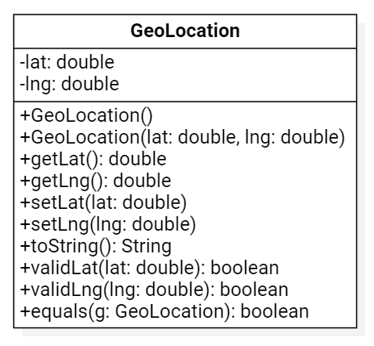
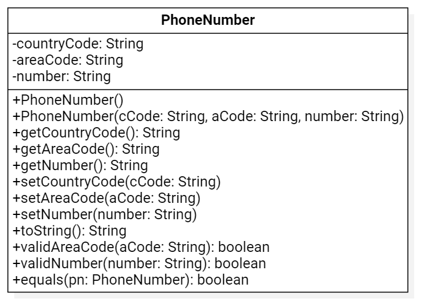
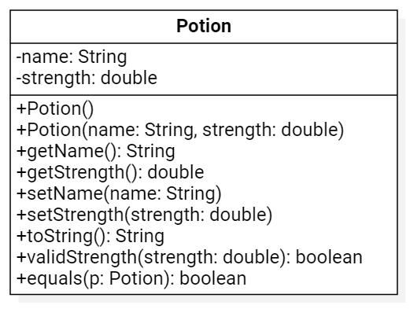

# Lab 4 - Writing Classes

## 02/21/2022

## Objectives

1. Learn how to write Java methods in a class
2. Learn to write instance variables and necessary methods in a class
3. Learn to test the Classes

## Exercises

### Performance Criteria

1. *Can write Java methods in a class.*
   * Can write a method with a return type, method name, parameter list, and a method body.
   * Can write a method with correct syntax.
2. *Can write a class.*
   * Can identify and declare instance variable(s).
   * Can write usual accessor and mutator methods for a class.
   * Can write constructors for a class.
   * Can write other required methods in a class such as toString()
3. *Can write an application class to test a class.*
   * Can instantiate objects of a class.
   * Can call methods to display objects' data.

### Assignment

#### Part I: GeoLocation Class

Write the class, `GeoLocation.java` following this UML Diagram and doing the following:

1. Create two instance variables, `lat` and `lng`, both of which should be `double`s.
2. Write the default constructor.
3. Write the non-default constructor.
4. Write 2 accessor methods, one for each instance variable.
5. Write 2 mutator methods, one for each instance variable.
6. Write a method that will return the location in the format `"(lat, lng)"` (the `toString` method).
7. Write a method that will return true if the latitude is between `-90` and `+90`.
8. Write a method that will return true if the longitude is between `-180` and `+180`.
9. Write a method that will compare this instance to another GeoLocation (the `equals` method).
10. Now write an application class that instantiates two instances of `GeoLocation`. One instance should use the default constructor and the other should use the non-default constructor. Display the values of the instance variables by calling the accessor methods.

#### Part II: PhoneNumber Class

Write the class, `PhoneNumber.java` following this UML Diagram and doing the following:

1. Create three instance variables, `countryCode`, `areaCode` and `number`, all of which should be `String`s.
2. Write the default constructor.
3. Write the non-default constructor.
4. Write 3 accessor methods, one for each instance variable.
5. Write 3 mutator methods, one for each instance variable.
6. Write a method that will return the entire phone number as a single string (the `toString` method).
7. Write a method that will return `true` if the `areaCode` is 3 characters long.
8. Write a method that will return `true` if the `number` is 7 characters long.
9. Write a method that will compare this instance to another `PhoneNumber` (the `equals` method).
10. Now write an application class that instantiates two instances of `PhoneNumber`. One instance should use the default constructor and the other should use the non-default constructor. Display the values of each object by calling the `toString` method.

#### Part III:  Class

Write the class, `Potion.java` following this UML Diagram and doing the following:

1. Create two instance variables, `name` (a `String`) and `strength` (a `double`).
2. Write the default constructor.
3. Write the non-default constructor.
4. Write two accessor methods, one for each instance variable.
5. Write two mutator methods, one for each instance variable.
6. Write a method that will return the entire  as a single string (the `toString` method).
7. Write a method that will return `true` if the `strength` is between 0 and 10.
8. Write a method that will compare this instance to another `Potion` (the `equals` method).
9. Now write an application class that instantiates two instances of `Potion`. One instance should use the default constructor and the other should use the non-default constructor. Display the values of each object by calling the `toString` method.
