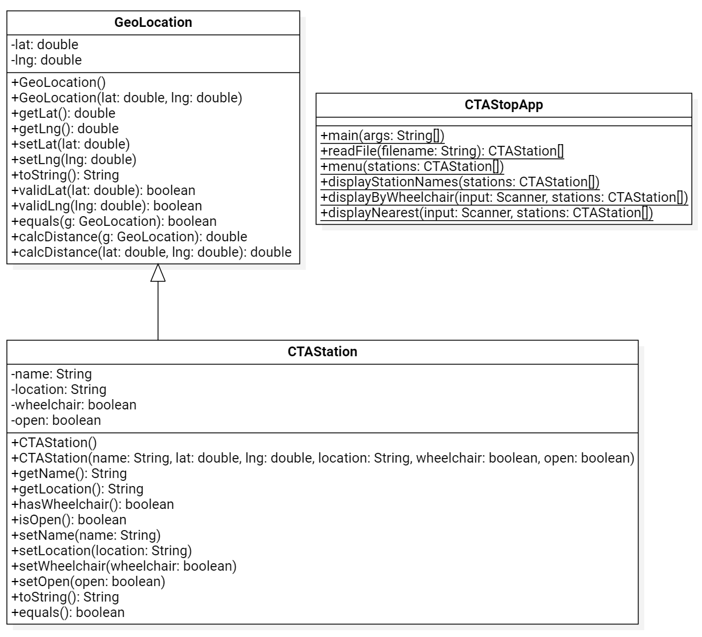

# Lab 5 - Inheritance/Polymorphism

## 03/07/2022

## Objectives

1. Be able to code a child class definition (inheritance)
2. Demonstrate knowledge of how to use the keyword `extends`
3. Demonstrate knowledge of how to code various non-default constructors using superclass constructors
4. Demonstrate knowledge of how to use super() in constructors
5. Demonstrate knowledge of how to use super in other subclass methods

## Exercise

In this assignment, you will write a user-defined class that will encapsulate a `CTAStation`. You will then use arrays to store `CTAStation` data.

Solution:

### GeoLocation

Add to your `GeoLocation` class from last week to include the following:

1. A method called `calcDistance` that takes another `GeoLocation` and returns a double. **Note:** This should use the formula `Math.sqrt(Math.pow(lat1 - lat2, 2) + Math.pow(lng1 - lng2, 2))`.
2. A method called `calcDistance` that takes a lng and lat and returns a double. **Note:** See above formula.

### CTAStation

Create a class that will implement a `CTAStation`, which should inherit from `GeoLocation`, with the UML diagram below.

### CTAStopApp

This application class will display a menu of options that the user can select from to display stations that meet certain criteria. The UML diagram for the class is as shown below, but here is the general description for each method:

main:

- Calls `readFile` to load the data
- Passes that data to `menu`

readFile:

- Reads stations from the input file and stores the data in an instance of `CTAStation[]`.

menu:

- Displays the menu options, which should be the following:
    - Display Station Names
    - Display Stations with/without Wheelchair access
    - Display Nearest Station
    - Exit
- Performs the operation requested by the user
- Loops until 'Exit' is chosen

displayStationNames:

- Iterates through `CTAStation[]` and prints the names of the stations.

displayByWheelchair:

- Prompts the user for accessibility ('y' or 'n')
- Checks that the input is 'y' or 'n', continues to prompt the user for 'y' or 'n' until one has been entered
- If char entered is a valid choice:
    - Determine which boolean to use ('y' -> `true`, 
    'n' -> `false`)
    - Loop through the `CTAStation[]` to look at wheelchair and display `CTAStation`s that meet the requirement
    - Display a message if _no_ stations are found

displayNearest:

- Prompts the user for a latitude and longitude
- Uses the values entered to iterate through the `CTAStation[]` to find the nearest station (using `calcDistance`) and displays it to the console

### UML Diagram

