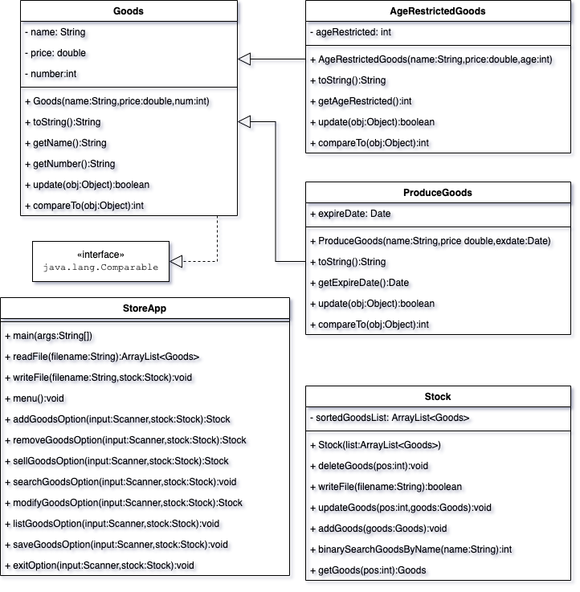

# Final Project

## The Problem

design and implement a program that models a general store and allows users to add stock to the store, search for available stock, and sell items.

## User Interface

The Menu Options:

1. Add  a new goods
2. Sell  goods
3. Remove goods
4. Search for a goods (by name)
5. Modify a goods
6. List all goods
7. Save the current stock
8. Exit

When start, if where is a stock.csv,than load the  file into store,and display the store\`s initial state ***The store is initialized from stock.csv*** . if where is no stock.csv file or load fail, than display the store\`s initial state ***The store is initialized empty from stock.csv, you can check the file`s format than restart or continue use the empty store***

### 1. Add  a new goods

This menu option  prompt the user for a new name of goods, than display to user if there already has the goods in store. If already has, than prompt the user to add the number of the goods. If there is no such goods, than prompt the user input goods information than add to store.

### 2. Sell  goods

This menu option continue prompt the user for a goods name than put the goods to cart and add the number in cart ,until the user ***quit*** the cart or ***check out*** , if the user check out ,than subtract the number of goods from store.If the number subtract to 0, than delete it.

### 3. Remove goods

This menu option  prompt the user for a goods name ,if there has the goods in store, than subtract the number of goods.If the number subtract to 0, than delete it.

### 4. Search for a goods (by name)

This menu option  prompt the user for a goods name , than display the goods  info to user .

### 5. Modify a goods

This menu option  prompt the user for a goods name , than display the goods info that user input.Than prompt the user input the update info of the goods , than update the store.

### 6. List all goods

This menu option display all goods infomation to user

### 7. Save the current stock

This menu option save all goods into stock.csv

### 6. Exit

Prompt the user select whether to save data when exit , than exit.

## Data Storage Description

The initial data file is stock.csv . The first field describes the type of product : Produce or Shelved or AgeRestricted, other values will be ignored. The last field describes the number of the product. The middle fields are the specific properties of the product.
The save data file is also stock.csv , with the same structure. 

## The programmers' tasks

### 1. read the input file.

For each line, split the string with "," , than use the first field to determine the type of goods, than Verify that each subsequent field value is legitimate , than use one line initial one Goods Object.

### 2. process the data from the input file.

Add each Object to ArrayList<Goods>, than sort the list .

### 3. store the data

Always keep the ArrayList<Goods> in order when add/delete/modify Goods.

### 4. add/delete/modify data

- add Goods: insert Goods into the correct position of ArrayList.
- delete Goods: when the number of Goods is subtract to 0, delete it from list, otherwise update the Goods number field .
- modify Goods: if the Goods name change, than delete it from list than insert it into the correct position. otherwise update the Goods  Object in list.

### 5. search the data?

As the ArrayList<Goods> is in order , user binary search . Implement the compareTo function for compare the Goods name.

### 6. the classes need to implement.

- Goods
- AgeRestrictedGoods
- ProduceGoods
- Stock
- StoreApp

## Test plan

[test plan](./testplan.csv)

## UML

